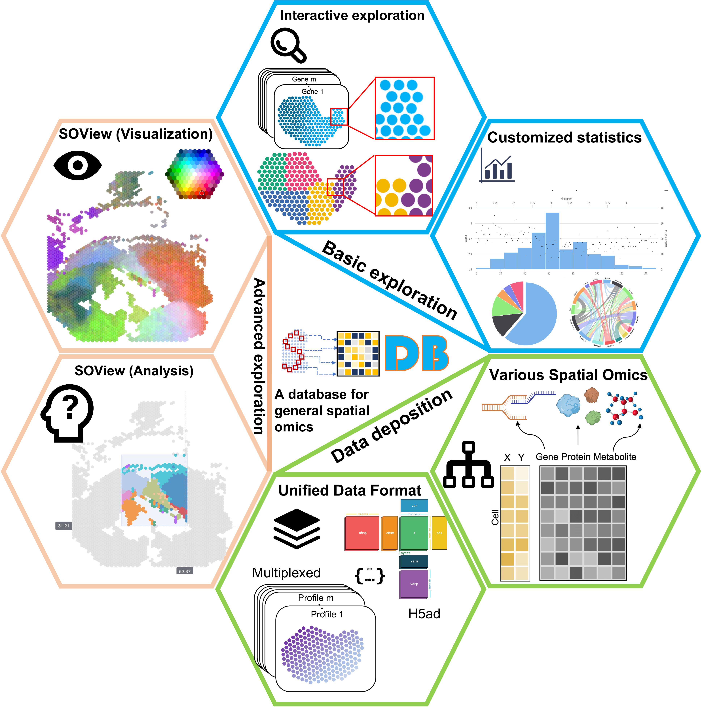

.. pysodb_tutorial documentation master file, created by
   sphinx-quickstart on Thu Sep 29 16:15:04 2022.
   You can adapt this file completely to your liking, but it should at least
   contain the root `toctree` directive.

pysodb
===========================================

Welcome to pysodb's documentation!

pysodb is a python package that provides the interface to get data in `SODB <https://gene.ai.tencent.com/SpatialOmics/>`_  .

.. toctree::
   :maxdepth: 1
   :caption: Contents:

   installation/installation
   api/api

.. toctree::
   :maxdepth: 2
   :caption: tutorial:

   scanpy/scanpy
   squidpy/squidpy
